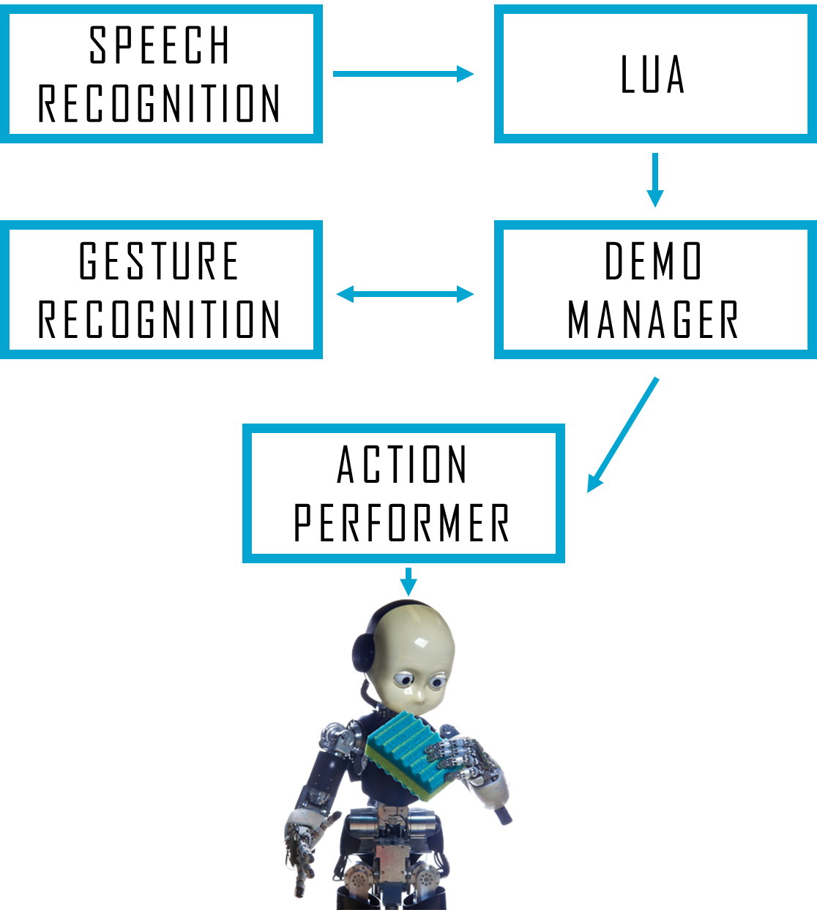

gestureRecognition
==================

This package contains modules that deal with gesture recognition using the Kinect (or Asus Xtion) sensor so as the stereo vision of the iCub. The gestureRecognition module implements a method to recognize gestures from a predefined set (examples of such gestures can be found in `app/conf/supported_actions_easy.jpg` or `app/conf/supported_actions_hard.jpg`). It is independent on the device and the operating system that is being used. Indeed, the `KinectWrapper` library, which is one of its dependencies, already provides an interface that deals with different devices and operating systems. The modules inside the game folder realizes, together with the gestureRecognition one, the memory game called [All gestures you can](https://www.youtube.com/watch?v=U_JLoe_fT3I&list=UUXBFWo4IQFkSJBfqdNrE1cA).

## Installation

##### Dependencies
- [YARP](https://github.com/robotology/yarp)
- [icub-contrib-common](https://github.com/robotology/icub-contrib-common)
- [KinectWrapper](https://github.com/robotology-playground/kinectWrapper.git)
- [OpenCV](http://opencv.org/downloads.html)

##### Cmaking the project
The project is composed of three modules. The gestureRecognition module can be used independently on the others. 

##### Running the gestureRecognition module
In order to utilize this module, the `KinectServer` module (coded in [KinectWrapper](https://github.com/robotology-playground/kinectWrapper.git)) has to be running.

## Architecture of the game

The game is structured in turns. One of the two players (the person or the robot) has to start performing a gesture. Then, the opponent recognizes the gesture, replicates it and adds a second random gesture to the sequence (from the pool of the possible gestures). At this point, the other player replicates the two gestures in the sequence, and adds a third gesture. This procedure is carried on until one of the two players loses.

The entire architecture can be run from the script files and can be seen in the following diagram:

 
 
First, the dependencies have to be launched (`app/scripts/demoGestureRecognitionDependencies.xml`), then the main modules (`app/scripts/demoGestureRecognition.xml`). Finally, the script `app/scripts/demoRec_main.lua` has to be launched. 

The commands that have to be provided are, respectively:

- **"Let's start"**, to start the game. If the robot starts, it will say **"It's your turn"**, and the person will just have to perform the gesture. Otherwise, the person will perform the gesture and then say **"Your turn"**.
- **"Your turn"**, as soon as the person is finished performing the gestures.
- **"You rock"**, after that the robot says **"I think you are wrong"**, to let the robot know that it won.
- **"You lost"**, after that the robot says **"I think you are wrong"**, to let the robot know that it lost.
- **"Game over"**, to quit the game straight away.
- **"Good bye"**, to close the LUA application. 

## License

Material included here is Copyright of _Istituto Italiano di Tecnologia_ and _EFAA Consortium_. gestureRecognition is released under the terms of the GPL v2.0 or later. See the file LICENSE for details.
